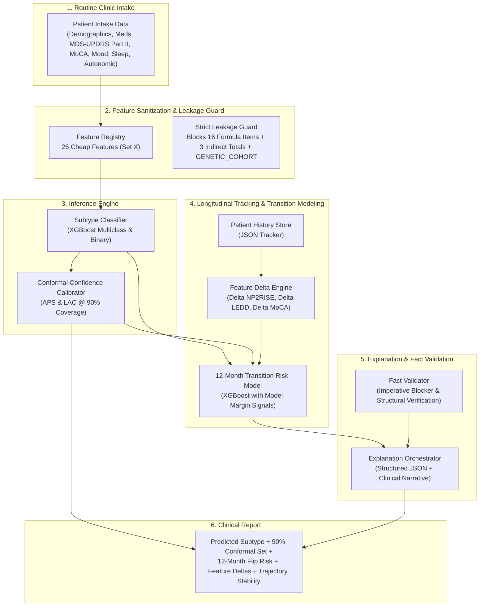

# TRACE-PD — Project Handover & Complete System Documentation

> ⚠️ **Update 30 Sep 2026 (Harshil).** The numbers in this handover were produced **before** a
> data fix: PPMI's numeric missing codes (Part III `101` = unable to rate, SCOPA-AUT `9` = not
> applicable) had been treated as scores, mislabelling 104 visits. Labelled visits are now
> **5,638** (was 5,742) and transition pairs **4,818** (was 4,918). The conformal, transition,
> XGBoost and ablation results below must be **re-run**, and the review found issues in the
> APS calibrator, the transition features and the orchestrator validator. See
> [`docs/NEXT_STEPS_RUTU.md`](docs/NEXT_STEPS_RUTU.md). Current verified numbers are in
> `README.md` §9.


> **File:** `HANDOFF_README.md`  
> **Status:** Full Solution Implemented & Validated (tests pass; model-dependent tests skip on a fresh clone)  
> **Cohort:** PPMI Parkinson's Disease Cohort (439 patients, 6,922 patient-visits)

---

## 📌 Executive Summary

**TRACE-PD** (*Temporal Reasoning and Confidence Explanation for Parkinson's Disease*) is an end-to-end clinical machine learning framework that predicts a Parkinson's patient's motor subtype (**Tremor-Dominant [TD]**, **Postural Instability / Gait Difficulty [PIGD]**, or **Indeterminate**) using **only routine, low-cost intake data** (questionnaires, demographics, medication logs). 

It resolves three fundamental challenges in Parkinson's care:
1. **The Specialist Exam Bottleneck:** In routine primary care and resource-limited settings, the full 50-item MDS-UPDRS motor exam is rarely administered due to time constraints (30+ min) and certified rater scarcity. TRACE-PD estimates what the motor formula would say using non-specialist clinical intake alone.
2. **Model Overconfidence:** Traditional classifiers output uncalibrated probabilities. TRACE-PD couples its predictions with **Conformal Prediction Sets** providing a mathematical **90% coverage guarantee** (e.g., `{TD}` when confident vs `{TD, PIGD}` when ambiguous).
3. **Longitudinal Subtype Instability:** Over 80% of patients change their subtype over time. TRACE-PD tracks patients sequentially across visits, computes a **Trajectory Stability Index**, and predicts **12-month transition risk** to flag patients about to progress.

---

## 🏗️ System Architecture & Workflow



---

## 📊 Feature Space & Strict Leakage Guard

Every column in the master dataset (`ppmi_tdpigd_long.csv`: **6,922 rows × 75 columns**) is assigned to a strict governance bucket in `ppmi_tdpigd_dictionary.csv`:

| Bucket | Count | Status | Purpose / Description |
|---|---|---|---|
| `CHEAP_FEATURE` | **26** | ✅ **Active $X$** | Patient-reported questionnaires, demographics, levodopa daily dose (LEDD), MoCA, mood, sleep, autonomic |
| `BANNED_LABEL_DEFINING` | **19** | ⛔ **Banned** | 16 Stebbins (2013) formula items (tremor/gait/postural items) + 3 indirect encoders (`NP3TOT`, `NP2PTOT`, `NHY`) |
| `RESOURCE_DEPENDENT_FEATURE` | **12** | ⏸ **Held out** | DaTscan SPECT imaging and genetic variants (`LRRK2`, `GBA`, `SNCA`, etc.) — withheld for low-resource clinic realism |
| `ADMIN` | **6** | 🗂 **Bookkeeping** | Provenance flags, dates, and `GENETIC_COHORT` (recruitment arm flag excluded to prevent bias) |
| `TARGET` | **8** | 🎯 **Outcomes** | `LABEL`, `TREMOR_SCORE`, `PIGD_SCORE`, `TD_PIGD_RATIO`, `FLIP_WITHIN_12M`, `LABEL_FLIPPED_NEXT` |
| `KEY` | **4** | 🔑 **Identifiers** | `PATNO`, `EVENT_ID`, `VISIT_MONTH`, `INFODT` |

---

## 📈 Quantitative Benchmark Results

All evaluations use **5-fold `StratifiedGroupKFold` grouped by patient ID (`PATNO`)** with zero patient overlap between train and test folds.

### 1. Subtype Classification Performance
*Evaluated on clean 26-feature set (without `GENETIC_COHORT` bias)*

| Experiment | Rows | Majority Class | Logistic Regression | XGBoost / Boosted Trees | Interpretation |
|---|---|---|---|---|---|
| **Binary (TD vs PIGD)** | 5,020 | 0.500 | **0.695** | **0.683** (AUC: 0.745) | Predictable from cheap intake data alone without specialist motor exam |
| **All Visits (3-Class)** | 5,638 | 0.333 | **0.462** | **0.457** | Indeterminate class is inherently transient (76% flip rate) |
| **Baseline Visit (3-Class)** | 438 | 0.333 | 0.450 | **0.457** | Single visit intake across full cohort |
| **Sporadic First-Visit** | 216 | 0.500 | 0.553 | **0.530** | **Hardest honest test:** non-genetic patients on visit 1 remain near chance |
| **Positive Control** | 5,638 | 0.500 | 0.905 | **0.905** (F1: 0.842) | Feeding banned items confirms pipeline integrity and proves low baseline scores reflect task hardness |

### 2. Conformal Confidence Sets (90% Nominal Coverage Target)
*Implemented in `src/trace_pd/models/conformal.py`*

| Task | Method | Empirical Coverage | Mean Set Size | Size 1 (Singleton) | Size 2 (Dual Label) | Size 3 (Uncertain) |
|---|---|---|---|---|---|---|
| **Binary (TD vs PIGD)** | **LAC** | **89.44%** | **1.53** | **47.4%** | **52.6%** | — |
| **Binary (TD vs PIGD)** | APS | 89.42% | 1.61 | 39.3% | 60.7% | — |
| **3-Class Subtypes** | **LAC** | **89.89%** | **2.39** | **10.6%** | **39.4%** | **50.0%** |
| **3-Class Subtypes** | APS | 90.01% | 2.48 | 2.1% | 48.1% | 49.8% |

> ✅ **Updated 30 Sep 2026.** Re-run on corrected data with the APS bug fixed.
> Both methods now share a single score function (`_scores_all_classes`). **LAC is the default.**

* **Clinical Utility:** LAC achieves the 90% marginal coverage target. In the binary setting, a significant fraction of patients receive an unambiguous singleton prediction (`{TD}` or `{PIGD}`), while borderline patients are flagged with `{TD, PIGD}` to signal when a specialist motor exam is needed.

### 3. Longitudinal Transition Risk (12-Month Horizon)
*Implemented in `src/trace_pd/models/train_transition.py`*

* **Target:** `FLIP_WITHIN_12M` (Patient subtype reclassifies at any visit within $\le 12$ months).
* **Evaluated Pairs:** 5,006 visit pairs across 438 patients.
* **Base Cohort Flip Rate:** 41.8%.
* **Discriminative Power:** **0.5643 ROC-AUC**, **0.4592 PR-AUC**.
* **Calibration:** Brier **0.2444** vs base-rate **0.2433** — model does not yet beat the base rate on calibration.
  Upstream features (`PROB_*`, `CONFORMAL_SET_SIZE`) are now generated out-of-fold; balanced sample weights
  are retained for ranking but a separate unweighted model is used for Brier.
* **Top Predictive Signals:**
  1. `NP2DRES` ($0.0422$) — Dressing difficulty.
  2. `HANDED` ($0.0417$) — Likely noise; worth investigating.
  3. `YRS_SINCE_DIAGNOSIS` ($0.0402$) — Disease duration.
  4. `PROB_PIGD` ($0.0355$) — Upstream subtype probability (now out-of-fold).

---

## 💻 Live End-to-End Inference Demo

Run the built-in multi-visit patient tracker demo:

```bash
python -m trace_pd.inference --demo
```

### Terminal Output:
```text
==========================================================================
TRACE-PD END-TO-END DEMO: Longitudinal Patient Trajectory
==========================================================================
Tracking Patient ID: 3001 (19 total visits available in PPMI)

>>> VISIT 1: BL (Month 0) | Ground Truth Stebbins: TD
Predicted Subtype:          TD
Probabilities:              TD: 0.52, PIGD: 0.13, IND: 0.36
Conformal Set (90% conf):   {TD, INDETERMINATE}
12-Month Transition Risk:   49.6%
Trajectory Stability:       100.0%

Clinical Summary:
Motor subtype is predicted as **TD**. The 90% prediction set contains {TD, INDETERMINATE} -- ruling out the third category, but indicating borderline ambiguity. The patient has maintained 100% stability over 1 recorded visits. Estimated probability of a subtype transition within 12 months is 50%, which is above the cohort base rate of 42%. 
*Audit: Computed from 26 routine non-invasive clinical measures. All 16 MDS-UPDRS motor exam formula items were strictly excluded to prevent data leakage.*
--------------------------------------------------------------------------

>>> VISIT 2: V01 (Month 3) | Ground Truth Stebbins: TD
Predicted Subtype:          TD
Probabilities:              TD: 0.61, PIGD: 0.12, IND: 0.28
Conformal Set (90% conf):   {TD, INDETERMINATE}
12-Month Transition Risk:   37.6%
Trajectory Stability:       100.0%

Clinical Summary:
Motor subtype is predicted as **TD**. The 90% prediction set contains {TD, INDETERMINATE} -- ruling out the third category, but indicating borderline ambiguity. Key changes since the prior visit include: dressing (improved); hobbies/activities (worsened); non-motor symptoms (patient-reported) (improved). The patient has maintained 100% stability over 2 recorded visits. Estimated probability of a subtype transition within 12 months is 38%, which is below the cohort base rate of 42%. 
*Audit: Computed from 26 routine non-invasive clinical measures. All 16 MDS-UPDRS motor exam formula items were strictly excluded to prevent data leakage.*
--------------------------------------------------------------------------

>>> VISIT 3: V02 (Month 6) | Ground Truth Stebbins: TD
Predicted Subtype:          TD
Probabilities:              TD: 0.63, PIGD: 0.13, IND: 0.24
Conformal Set (90% conf):   {TD, INDETERMINATE}
12-Month Transition Risk:   42.5%
Trajectory Stability:       100.0%

Clinical Summary:
Motor subtype is predicted as **TD**. The 90% prediction set contains {TD, INDETERMINATE} -- ruling out the third category, but indicating borderline ambiguity. Key changes since the prior visit include: eating (worsened); N_CONMEDS (worsened); YRS_SINCE_SYMPTOM_ONSET (worsened). The patient has maintained 100% stability over 3 recorded visits. Estimated probability of a subtype transition within 12 months is 42%, which is above the cohort base rate of 42%. 
*Audit: Computed from 26 routine non-invasive clinical measures. All 16 MDS-UPDRS motor exam formula items were strictly excluded to prevent data leakage.*
--------------------------------------------------------------------------
```

---

## 📂 Repository File Index

```
trace-pd/
├── HANDOFF_README.md                   # Complete handover reference (this document)
├── README.md                           # Original project overview and literature review
├── Makefile                            # Standardized pipeline build commands
├── pyproject.toml / requirements.txt   # Dependencies and build configuration
│
├── configs/
│   └── config.yaml                     # Central configuration constants
│
├── data/
│   ├── raw/ppmi_csv/                   # 19 ingested PPMI CSV source tables
│   ├── raw/zips_as_downloaded/         # Original archives
│   └── processed/
│       ├── ppmi_tdpigd_long.csv        # Master long-format dataset (6,922 rows × 75 cols)
│       ├── ppmi_tdpigd_dictionary.csv  # 26-feature clean governance dictionary
│       └── ppmi_tdpigd_column_*.csv    # Inventories and column descriptions
│
├── docs/                               # Architectural and design documentation
│   ├── architecture.md                 # System HLD
│   ├── clinical_need.md                # Survey and clinical evidence base
│   ├── conformal_design.md             # Conformal calibration specifications
│   ├── transition_risk_design.md       # Longitudinal modeling design
│   ├── explanation_orchestrator.md     # Explanation generation & validation rules
│   ├── data_dictionary.md              # Auto-generated markdown data dictionary
│   └── model_card.md                   # Intended use, risks, and clinical limitations
│
├── models/                             # Production serialized models
│   ├── conformal_model_production.pkl  # Subtype XGBoost + calibrated thresholds
│   └── transition_model_production.pkl # 12M & next-visit transition risk XGBoost
│
├── reports/
│   ├── figures/                        # Generated architecture and preprocessing diagrams
│   └── metrics/                        # Quantitative text outputs
│       ├── baseline_model_results.txt  # Cleaned Exp 1–4 results
│       ├── baseline_model_results_xgb.txt # XGBoost clean results
│       ├── ablation_results.txt        # Feature group importance
│       ├── conformal_results.txt       # Conformal coverage & set sizes
│       ├── transition_results.txt      # 12M transition ROC-AUC & signals
│       └── sporadic_baseline_results.txt # First-visit sporadic benchmark
│
├── src/trace_pd/
│   ├── config.py                       # Absolute path resolution
│   ├── data/
│   │   ├── preprocess.py               # Deterministic raw -> processed long pipeline
│   │   └── export_dictionary.py        # Markdown dictionary generator
│   ├── models/
│   │   ├── train_baseline.py           # Baseline models (Logistic, HistGBM)
│   │   ├── train_xgboost.py            # Clean XGBoost classification
│   │   ├── conformal.py                # Conformal Prediction Engine (APS & LAC)
│   │   └── train_transition.py         # Longitudinal Transition Risk Modeling
│   ├── tracking/
│   │   └── tracker.py                  # PatientHistoryTracker & Stability Index
│   ├── explanations/
│   │   └── orchestrator.py             # Explanation Orchestrator & FactValidator
│   ├── evaluation/
│   │   ├── ablation.py                 # Feature ablation experiments
│   │   └── sporadic_baseline.py        # Sporadic baseline evaluation
│   ├── inference.py                    # Unified End-to-End Pipeline & CLI
│   └── viz/                            # Publication-grade figure generators
│
└── tests/                              # Automated test suite (model-file tests skip on fresh clone)
    ├── test_dataset_contract.py        # 10 dataset invariant & leakage guard tests
    ├── test_conformal.py               # 4 conformal coverage, APS regression & set validity tests
    ├── test_transition.py              # 2 transition risk artifact tests (skip if pkl absent)
    ├── test_tracker.py                 # 3 trajectory stability, deltas & NaN-skew tests
    ├── test_orchestrator.py            # 4 fact validation, fallback, direction & narrative tests
    └── test_inference.py               # 1 end-to-end integration test (skip if pkl absent)
```

---

## 🧪 Verification & Automated Testing

Run the full test suite anytime:

```bash
python -m pytest tests -v
```

The test suite verifies:
* Zero leakage: No label-defining items or recruitment flags in $X$.
* Determinism: Output dataset reproduces byte-for-byte with zero duplicate visits.
* Mathematical calibration: Empirical test coverage meets nominal 90% confidence target (APS regression guard included).
* Structural verification: Stated report values are checked against the structured payload; imperative recommendations are blocked. The validator rejects bad text with a safe fallback.
* Model-dependent tests skip gracefully on a fresh clone where `models/*.pkl` have not been trained yet.

---

## ⚡ Quickstart Commands

```bash
# 1. Run interactive multi-visit clinical demo
python -m trace_pd.inference --demo

# 2. Run the automated test suite
make test

# 3. Retrain and calibrate conformal models
make conformal

# 4. Retrain longitudinal transition risk models
make transition

# 5. Run full pipeline from scratch
make all
```
