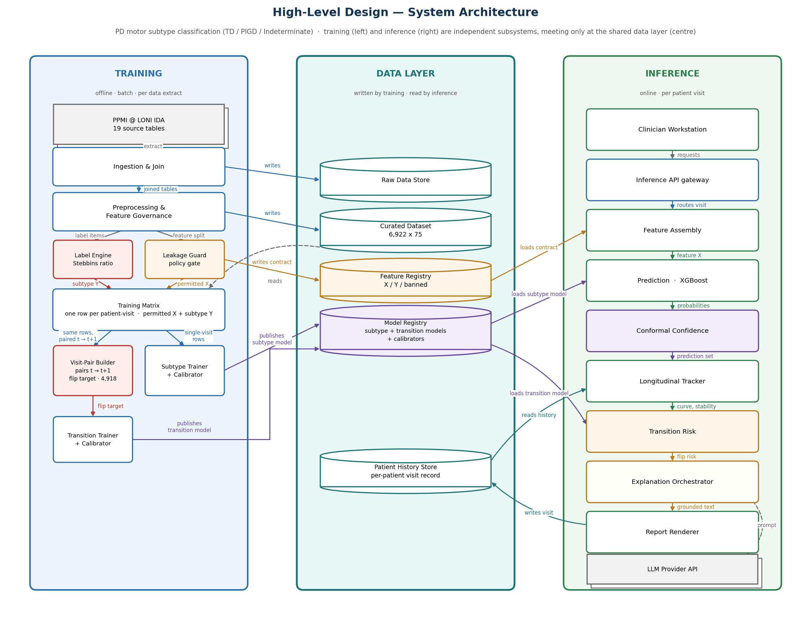

# TRACE-PD

**Temporal Reasoning and Confidence Explanation for Parkinson's Disease**

TRACE-PD predicts a Parkinson's patient's **motor subtype**: tremor-dominant (**TD**),
postural instability / gait difficulty (**PIGD**), or **Indeterminate**. It uses only routine,
low-cost clinical data and is built on the PPMI cohort. The design goes further: a calibrated
confidence set for every prediction, and a flag for patients whose subtype is likely to change
at the next visit.

This README covers what the project is, how we got here, every decision we made and why,
which columns go into the model and which were kept out, and what the results actually show.

---

## Contents

1. [The problem in plain words](#1-the-problem-in-plain-words)
2. [Why predict something a formula already computes?](#2-why-predict-something-a-formula-already-computes) — incl. clinical-need evidence and literature gap
3. [How we got here — project history](#3-how-we-got-here--project-history)
4. [Data](#4-data)
5. [The label (Y)](#5-the-label-y)
6. [The features (X) — what we used and what we kept out](#6-the-features-x--what-we-used-and-what-we-kept-out)
7. [Decision log](#7-decision-log)
8. [Modelling](#8-modelling)
9. [Results](#9-results)
10. [System architecture](#10-system-architecture)
11. [Repository layout](#11-repository-layout)
12. [How to run](#12-how-to-run)
13. [Status](#13-status)
14. [Limitations](#14-limitations)
15. [Data use](#15-data-use)
16. [Deliverables and what changed](#16-deliverables-and-what-changed)
17. [What is intentionally not in this repo](#17-what-is-intentionally-not-in-this-repo)

---

## 1. The problem in plain words

Parkinson's disease does not look the same in every patient. Most patients fall into one of
two **motor subtypes**:

| Subtype | What dominates | Typical course |
|---|---|---|
| **TD** — tremor-dominant | shaking at rest | slower decline, better treatment response |
| **PIGD** — postural instability / gait difficulty | balance problems, shuffling, freezing | **faster decline, more falls, weaker response to levodopa and DBS** |

The subtype matters because it changes how closely a patient should be monitored and treated.

**The clinical problem:** it typically takes **6–7+ visits over a year or more** before a
clinician is confident of the subtype. Even then, a third to half of patients are
**reclassified within 1–2 years**. During that delay, a fast-declining PIGD patient can be
managed as a milder TD case. In India, where diagnosis is often symptom-based and
movement-disorder specialists are scarce, the delay is longer.

**What TRACE-PD tries to do:**

- predict the subtype from data that is **already collected routinely**
- attach a **calibrated confidence** to every prediction instead of a bare label
- track the prediction **visit by visit** and flag patients likely to flip
- **explain** in plain language what changed between visits

---

## 2. Why predict something a formula already computes?

This is the most important question to answer about the project.

The subtype has a published, deterministic definition: the **Jankovic (1990) / Stebbins
et al. (2013)** ratio, computed from **16 MDS-UPDRS items** (see §5). If a clinician
completes all 16 items, you just apply the formula. No model is needed.

The model only matters when **the full motor exam is not completed**. That is common: it
takes time, and parts of it need a trained examiner. So the question TRACE-PD asks is:

> *Given only the cheap, routinely collected data — and **none** of the 16 items that define
> the label — how well can we predict what the formula would say?*

That framing forces the central design rule of the whole project:

> **No column that participates in computing Y may be used for training.**

A model allowed to see those items just re-does the arithmetic. As a deliberate check, we
fed them back in and got **0.905 accuracy** — a meaningless number, because the model was
measuring nothing it didn't already have (§9.4).

It also defines what the tool is for in practice: **triage**. If the model is confident, the
clinician can plan around that subtype. If it's uncertain, that is the signal to do the full
motor exam **now** instead of waiting another visit.

### 2.1 Is there a real clinical need? — the evidence

The whole project depends on the full motor exam **not** being routinely done. We checked
that assumption against published evidence. Full write-up with sources:
[`docs/clinical_need.md`](docs/clinical_need.md).

| Setting | Evidence |
|---|---|
| **Everywhere** | MDS-UPDRS is 50 items / ~30 min, needs a certified rater (MDS certificate programme; Part III training alone ~2 h), and is "not always administered at every clinical visit" — typically every 6–12 months, mostly in research cohorts |
| **India** (survey of 267 clinicians, 23 states) | only **12.6%** of initial diagnoses are made by a movement-disorder specialist; specialists are "rarely accessible locally" for **79.2%**; 92.1% of respondents are urban |
| **India — imaging / genetics** | **94.4%** rarely advise DaTscan and **94.9%** rarely advise genetic testing — so these are *more* scarce than the exam, which is why they're held out of X (§6.3) |
| **UK** | NICE NG71 says review every 6–12 months. That's a review *frequency*, not a full item-level MDS-UPDRS at each contact |

**The objection we had to face.** PPMI **does** the full exam at every visit, by protocol.
That's why we can train (every visit has ground truth), but it also means "predict earlier"
only makes sense outside PPMI. The claim we can defend is narrower:

> *In settings where the full exam isn't done, estimate what it would say — and say how much
> to trust that estimate.*

**Gap in the argument:** no source gives a direct figure for "% of routine PD visits with a
complete item-level MDS-UPDRS". The case is assembled from adjacent evidence — burden,
certification, specialist scarcity, guideline wording — and should be presented that way.

### 2.2 What existing work misses

Seven recent papers, reviewed in the first-review deck. Citations are verified and each paper's
gap is set out in [`docs/literature_review.md`](docs/literature_review.md).

| # | Paper | Gap it leaves |
|---|---|---|
| 1 | Diaz-Rincon et al. 2026, *CASCADE* conformal (arXiv) | PD **medication dosing**, not subtype; single visit |
| 2 | Kristoffersen et al. 2026, 7T MRI subtypes (arXiv) | needs **7T MRI**; no calibrated confidence |
| 3 | Modi et al. 2026, LLM reasoning variability (medRxiv) | shows LLM accuracy can swing **>50%** on prompt format — why our LLM decides nothing |
| 4 | Yeh et al. 2026, ML risk + SHAP + LLM (*ICM Experimental*) | ICU, not PD; no confidence; SHAP explains one prediction, not change |
| 5 | Sreenivasan et al. 2025, conformal in MS (*npj Digit Med*) | MS, not PD; no transition framing |
| 6 | Hui et al. 2025, DL + radiomics subtypes (*Front Neurol*) | same-visit **MRI**; no confidence |
| 7 | Tassopoulou et al. 2025, conformal bands (NeurIPS) | Alzheimer's biomarker, not a PD subtype label |

**The gap.** Subtype classifiers need imaging and report no per-patient confidence. The
conformal work isn't about PD subtype. Nothing handles the **longitudinal** instability of the
label — which reclassifies a third to half of patients within 1–2 years — or explains *why*
confidence changed between visits. TRACE-PD's design targets all five. Only the imaging-free
subtype classifier is built so far (§13).

---

## 3. How we got here — project history

The project went through one major pivot. Both phases are recorded here so the reasoning is
traceable.

### Phase 1 — invented progression labels (abandoned)

The first approach clustered patients into **slow / moderate / fast progressors** with
K-Means on motor, cognitive and autonomic change scores. The cohort was **229 patients**
(sporadic PD with ≥3 years of follow-up).

We tested whether those clusters were real:

| Check | Result | What it told us |
|---|---|---|
| 3-domain vs 5-domain K-Means | silhouette **0.300** vs **0.185**; 18.8% of patients relabelled | the labels depend on which features you pick |
| Six clustering methods compared | K-Means 0.300, GMM 0.266, Agglomerative 0.298, K-Medoids 0.225, **HDBSCAN 0.169** | no method found well-separated groups |
| HDBSCAN (density-based) | could not find 3 dense clusters without calling **39% of patients noise** | the "clusters" were slices of a continuum |

**Why we abandoned it:** progression speed is a **continuum**, and cutting it into three
bins produces labels that are artefacts of the method. A reviewer can rightly ask *"who
validated these categories?"* — and nobody had. Labels invented by the model can't serve as
ground truth for that same model.

### Phase 2 — published clinical label (current)

We switched to the **TD / PIGD / Indeterminate** classification. It is published,
peer-reviewed, used across PD registries, and needs **no new clinical validation**.

The switch also fixed the sample-size problem:

| | Phase 1 (K-Means) | Phase 2 (TD/PIGD) |
|---|---|---|
| Patients | 229 | **439** |
| Labelled training units | 229 (one per patient) | **5,638** (one per visit) |
| Label origin | invented by clustering | published formula |
| Follow-up filter | ≥ 3 years required | none needed |

Phase 1 code and outputs are **not included** in this repository.

The two source documents — the original proposal and the renewed approach — are in
[`docs/proposals/`](docs/proposals/). That folder also traces every promise in them to what
was built, changed or dropped. One example: the proposal's *"which test should the doctor
order?"* layer was dropped. Its main candidate tests (DaTscan, genetics) are exactly the inputs
held out of X, and it was replaced by transition risk.

---

## 4. Data

### 4.1 Source

**PPMI** — Parkinson's Progression Markers Initiative, via the LONI Image & Data Archive.
Extract dated **16 Aug 2026**.

`data/raw/ppmi_csv/` holds 23 CSVs. **19 are used** by the pipeline:

| Group | Tables | Joined on |
|---|---|---|
| **Visit-level (12)** | MDS-UPDRS Part I · Part I Patient Questionnaire · Part II Patient Questionnaire · Part III · MoCA · SCOPA-AUT · GDS-15 · STAI · Epworth · RBD Screening · Age at Visit · Xing Core Lab Quant SBR | `PATNO + EVENT_ID` (outer) |
| **Static per patient (5)** | Subject Cohort History · Demographics · PD Diagnosis History · IU Genetic Consensus · Xing Core Lab Visual Read | `PATNO` (left) |
| **Medication logs (2)** | LEDD Concomitant Medication Log · Concomitant Medication Log | **date interval** (see §4.5) |

The other 4 CSVs (Clinical Diagnosis, Dopamine Imaging, MDS-UPDRS Part IV, WGS Variants
2018) were downloaded but are **not used**.

### 4.2 Cohort

**Included:** `COHORT == 1`, the PPMI Parkinson's disease cohort → **439 patients**.

| Sub-group | Code | n |
|---|---|---|
| Sporadic PD | `APPRDX == 1` | 242 |
| Genetic-cohort PD | `APPRDX == 5` | 197 |

The genetic cohort is **enriched for LRRK2 / GBA / SNCA carriers by recruitment design**.
It is not a random sample of PD, which turns out to matter a lot (§9.3). The Phase 1 pipeline
filtered on `APPRDX == 1` only, which silently threw away all 197 genetic-cohort patients.
That was a mistake, not a choice.

### 4.3 Visits

Visit codes are mapped to months since baseline (`BL`=0, `V01`=3, `V02`=6 … `V20`=96).
**3,703 rows dropped** for visit codes with no fixed place on the timeline: screening,
log, early discontinuation, unscheduled, remote/telephone check-ins.

**No minimum follow-up filter.** Phase 1 needed ≥3 years because its label was a rate. The
TD/PIGD label is computed independently at each visit, so the filter is obsolete. Removing
it is the biggest single reason the sample grew.

### 4.4 Final table

`data/processed/ppmi_tdpigd_long.csv` — **long format, one row per patient-visit.**

| Property | Value |
|---|---|
| Shape | **6,922 rows × 75 columns** |
| Patients | 439 (2–21 visits each, median 17) |
| Rows with a label | **5,638** (81.5%) |
| Duplicate `PATNO + EVENT_ID` | 0 — asserted in code |
| Class balance (all visits) | TD 53.5% · PIGD 35.5% · Indeterminate 11.0% |
| Class balance (baseline) | TD 60.7% · PIGD 27.9% · Indeterminate 11.4% |

**Why long format.** The label is computed per visit, and the flip target needs consecutive
visits of the same patient. Per-round **wide** tables — one row per patient with a suffixed
copy of the features for each included visit, plus between-visit deltas — are built downstream
from this table.

**Round structure** — patients with a computable label at **every** included visit:

| Round | Visits | Patients |
|---|---|---|
| 1 | BL | **438** |
| 2 | BL + 6 mo | 349 |
| 3 | BL + 6 + 12 mo | 323 |
| 4 | BL + 6 + 12 + 24 mo | 269 |
| alt. annual-only | BL + 12 mo | 402 |
| alt. annual-only | BL + 12 + 24 mo | **337** |

The 6-month visit is the weak link (438 → 349). It's a lighter interim visit in the PPMI
protocol. An **annual-only** design (BL → 12 → 24 mo) keeps 337 patients at the final round
instead of 269, with fuller instrument coverage. **Recommended for the round experiments.**

### 4.5 A bug we found and fixed: medications

The LEDD and concomitant-medication logs are **running records**, not visit records.
Their `EVENT_ID` is only ever `LOG`, `ED` or `SC`. Joining them on `PATNO + EVENT_ID` against
scheduled visits (`BL`, `V01`…) matches **nothing**. In the Phase 1 table, `LEDD_TOTAL_MG`
was **100% missing** without anyone noticing.

**Fix:** each record has `STARTDT` and `STOPDT`. For every patient-visit we sum the LEDD of
all medications whose interval covers that visit date.

**Proof it works:** median LEDD is **0 mg at baseline**, which matches PPMI enrolling
drug-naive patients. It then rises monotonically — 300 mg at 12 months, 500 mg at 24 months.

### 4.6 Missing data — structural, and deliberately not imputed

PPMI runs **annual visits** with the full battery and lighter **interim visits** with a
subset. Missingness follows that schedule exactly:

| Instrument | % present | Why |
|---|---|---|
| Sex, handedness, genetic cohort | 100% | static |
| Age at visit | 99.6% | every visit |
| Part II items, Part I totals, LEDD | ~92% | every visit |
| SCOPA-AUT, GDS, STAI, Epworth, RBD | ~67% | 6-month + annual schedule |
| MoCA | 52.3% | annual visits only |

**No imputation in preprocessing**, for two reasons:

1. Phase 1's median imputation **flattened DaTscan binding ratio to a constant 0.68** for
   every subtype, destroying the signal it was meant to validate.
2. Imputing before splitting **leaks test-fold information** into training. Any imputation
   happens inside CV folds. XGBoost handles `NaN` natively.

### 4.7 ON / OFF medication state

Part III is sometimes scored twice at one visit, OFF and ON medication. Medication
suppresses tremor, which can shift the ratio and flip the label. **We keep the OFF-state
assessment** (untreated severity). `PDSTATE_USED` records which state was used for each row.

### 4.8 A second bug we found and fixed: numeric missing-data codes

PPMI writes two "not a score" answers as **numbers**:

| Instrument | Code | Means | What went wrong |
|---|---|---|---|
| MDS-UPDRS Part III (label items, `NHY`) | **101** | unable to rate | averaged into the tremor / PIGD score as if it were a severity of 101 |
| SCOPA-AUT (feature) | **9** | not applicable | summed into `SCOPA_AUT_TOTAL`, adding 9 points of fake autonomic burden each time |

The preprocessing replaced the *text* code `UR` but not these numeric ones. **104 labelled
visits (77 patients) had a wrong label, and 98 of them were forced to PIGD**, because a 101 in
postural stability inflates the PIGD score. The "0 mismatches" check didn't catch it: it
recomputed the label from the same contaminated scores, so it proved the arithmetic was
consistent, not that the inputs were valid.

**Fixed 30 Sep 2026:** both codes are converted to missing before any score is computed, and two
contract tests now fail if either code ever reaches the data. Labelled visits went from 5,742
to 5,638. Model results barely moved (§9).

---

## 5. The label (Y)

Computed per patient-visit, following **Stebbins et al. (2013)**.

**Tremor score** = mean of **11** items:

| Item | Description | Column |
|---|---|---|
| 2.10 | Tremor (patient-reported) | `NP2TRMR` |
| 3.15 a/b | Postural tremor, right / left hand | `NP3PTRMR`, `NP3PTRML` |
| 3.16 a/b | Kinetic tremor, right / left hand | `NP3KTRMR`, `NP3KTRML` |
| 3.17 a–e | Rest tremor amplitude: RUE, LUE, RLE, LLE, lip/jaw | `NP3RTARU`, `NP3RTALU`, `NP3RTARL`, `NP3RTALL`, `NP3RTALJ` |
| 3.18 | Constancy of rest tremor | `NP3RTCON` |

**PIGD score** = mean of **5** items:

| Item | Description | Column |
|---|---|---|
| 2.12 | Walking and balance (patient-reported) | `NP2WALK` |
| 2.13 | Freezing (patient-reported) | `NP2FREZ` |
| 3.10 | Gait | `NP3GAIT` |
| 3.11 | Freezing of gait | `NP3FRZGT` |
| 3.12 | Postural stability | `NP3PSTBL` |

**Rule:** `ratio = tremor score / PIGD score`

| Ratio | Label |
|---|---|
| ≥ 1.15 | **TD** |
| ≤ 0.90 | **PIGD** |
| between | **Indeterminate** |

**Edge cases** (the ratio is undefined when PIGD = 0):

- PIGD = 0, tremor > 0 → **TD** (tremor present, no gait signs)
- PIGD = 0, tremor = 0 → **Indeterminate** (nothing on either side)

This affects **845 rows (15.0%)**. It is our explicit convention, so it has to be stated in
the paper.

**Completeness rule:** a label is assigned only when **all 16 items are present**. We never
compute a label from a partial average. That's why 18.5% of rows have no label.

**Missing-data codes:** PPMI records *unable to rate* in Part III as the number **101**. It is
converted to missing before the formula runs, so those visits stay unlabelled. It was
originally missed — see §4.8.

**Verified:** every label was recomputed independently from its component scores — **0
mismatches across 5,638 rows**. The class boundaries land exactly where they should (PIGD
max 0.868; Indeterminate 0.909–1.136; TD min 1.162).

### Second target: will the label flip?

`LABEL_FLIPPED_NEXT` = 1 if the patient's label at their **next scheduled visit** differs from
the current one. It's built by shifting within each patient (`groupby("PATNO").shift(-1)`), so
a patient's last visit never borrows the next patient's first.

| Current label | Flip rate at next visit | Pairs |
|---|---|---|
| TD | 20.2% | 2,722 |
| PIGD | 27.0% | 1,555 |
| Indeterminate | **76.2%** | 541 |
| **Overall** | **28.7%** | **4,818** |

**Where 4,818 comes from:** 5,638 labelled rows − 200 final visits (no next row) − 620 rows
whose next visit is unlabelled = 4,818 pairs.

The 28.7% overall rate is consistent with the published "a third to half reclassified within
1–2 years", which independently suggests the formula was implemented correctly. **344 of 439
patients (78.4%) change label at least once.**

Full transition design — features, pitfalls, fixed-horizon recommendation:
[`docs/transition_risk_design.md`](docs/transition_risk_design.md).

---

## 6. The features (X) — what we used and what we kept out

Every one of the 75 columns is assigned a **bucket** by rule in
`data/processed/ppmi_tdpigd_dictionary.csv`. The full per-column reference — description,
source, type, completeness — is in [`docs/data_dictionary.md`](docs/data_dictionary.md),
generated by `make docs`. Training code selects features **by bucket
only** — never by hand. A test (`tests/test_dataset_contract.py`) fails if any label-defining
column ever lands in a feature bucket.

| Bucket | Columns | Used for training? |
|---|---|---|
| `CHEAP_FEATURE` | **26** | ✅ **Yes — this is X** |
| `RESOURCE_DEPENDENT_FEATURE` | 12 | ❌ No — imaging / genetics |
| `BANNED_LABEL_DEFINING` | 19 | ❌ **Never** — they define Y |
| `TARGET` | 8 | ❌ No — outcomes |
| `KEY` | 4 | ❌ No — identifiers |
| `ADMIN` | 6 | ❌ No — bookkeeping (incl. `GENETIC_COHORT`) |
| **Total** | **75** | |

### 6.1 ✅ What goes into X — 26 `CHEAP_FEATURE` columns

"Cheap" means: patient-reported or low-cost, and plausibly available in a non-specialist
clinic.

| Group | Column | What it is | Source |
|---|---|---|---|
| **Demographics** | `AGE_AT_VISIT` | age at this visit | Age at Visit |
| | `SEX` | sex | Demographics |
| | `HANDED` | handedness | Demographics |
| **Disease timeline** | `YRS_SINCE_DIAGNOSIS` | years from diagnosis to this visit | derived: PD Diagnosis History + visit date |
| | `YRS_SINCE_SYMPTOM_ONSET` | years from first symptom to this visit | derived: PD Diagnosis History + visit date |
| **Medication** | `LEDD_TOTAL_MG` | total levodopa-equivalent daily dose active on visit date | LEDD log, date-interval join |
| | `N_CONMEDS` | number of concomitant medications active on visit date | Concomitant Med log, date-interval join |
| | `PDTRTMNT` | on PD treatment at this visit (yes/no) | MDS-UPDRS Part III header |
| **Non-motor burden** | `NP1RTOT` | Part I total, examiner-rated | MDS-UPDRS Part I |
| | `NP1PTOT` | Part I total, patient-completed | MDS-UPDRS Part I PQ |
| **Daily living (Part II)** | `NP2SPCH` | speech | MDS-UPDRS Part II |
| | `NP2SALV` | saliva / drooling | Part II |
| | `NP2SWAL` | chewing and swallowing | Part II |
| | `NP2EAT` | eating tasks | Part II |
| | `NP2DRES` | dressing | Part II |
| | `NP2HYGN` | hygiene | Part II |
| | `NP2HWRT` | handwriting | Part II |
| | `NP2HOBB` | hobbies and activities | Part II |
| | `NP2TURN` | turning in bed ⚠️ see §9.3 | Part II |
| | `NP2RISE` | getting out of bed / a chair ⚠️ see §9.3 | Part II |
| **Cognition** | `MCATOT` | MoCA total | MoCA |
| **Mood** | `GDS_TOTAL` | depression (GDS-15 item sum) | GDS-15 |
| | `STAI_TOTAL` | anxiety (STAI item sum) | STAI |
| **Sleep** | `ESS_TOTAL` | daytime sleepiness (Epworth item sum) | Epworth |
| | `RBDSQ_TOTAL` | REM sleep behaviour disorder screen (item sum) | RBD Screening |
| **Autonomic** | `SCOPA_AUT_TOTAL` | autonomic symptoms (SCOPA-AUT item sum) | SCOPA-AUT |

**Why these:** they are exactly the data a general neurologist or physician already collects,
by questionnaire or simple history. Nothing needs a movement-disorder specialist, a scanner,
or a genetic test. Part II is patient-reported — the patient fills it in — so the 10 Part II
items that are **not** in the formula count as cheap and are used.

> **Note on the "item sum" totals:** PPMI didn't ship pre-computed totals for SCOPA-AUT,
> GDS, STAI, Epworth or RBD, so these are **plain sums of raw item codes**. They are not the
> official reverse-coded scores and must not be reported as validated instrument totals —
> only as monotonic severity proxies.

### 6.2 ❌ Never allowed — 19 `BANNED_LABEL_DEFINING` columns

**(a) The 16 formula items themselves.** Using them means re-deriving Y.

| From | Columns |
|---|---|
| Part II — patient-reported (3) | `NP2TRMR`, `NP2WALK`, `NP2FREZ` |
| Part III — tremor (10) | `NP3PTRMR`, `NP3PTRML`, `NP3KTRMR`, `NP3KTRML`, `NP3RTARU`, `NP3RTALU`, `NP3RTARL`, `NP3RTALL`, `NP3RTALJ`, `NP3RTCON` |
| Part III — gait / balance (3) | `NP3GAIT`, `NP3FRZGT`, `NP3PSTBL` |

**(b) Three columns that encode the same information indirectly.** These are easy to miss,
so they are listed on purpose:

| Column | Why it's banned |
|---|---|
| `NP3TOT` | the Part III **total** — it sums the 13 Part III formula items into itself |
| `NP2PTOT` | the Part II **total** — it sums the 3 Part II formula items into itself |
| `NHY` | **Hoehn & Yahr** stage — stage ≥ 3 is *defined* by postural instability, so it restates the PIGD construct |

**The Part II decision.** The 3 Part II formula items are patient-reported, so they're cheap
to collect. We weighed two options:

- **Variant A** — allow them, and disclose the overlap
- **Variant B** — ban them: strict, cleaner, harder

**We chose Variant B (strict), on 10 Sep 2026.** Even 3 of the 16 inputs is partial label
leakage, and it would undermine any claim about what the model learned.

### 6.3 ❌ Held out — 12 `RESOURCE_DEPENDENT_FEATURE` columns

| Kind | Columns |
|---|---|
| DaTscan imaging (4) | `CAUDATE_REF_CWM`, `PUTAMEN_REF_CWM`, `STRIATUM_REF_CWM`, `DATSCAN_VISINTRP` |
| Genotype (8) | `APOE`, `GBA`, `LRRK2`, `PARK7`, `PINK1`, `PRKN`, `SNCA`, `VPS35` |

**Why held out:** they don't leak the label. They're kept out because they **aren't available
where this tool is meant to be used**. Survey evidence shows ~94% of Indian clinicians rarely
order DaTscan (94.4%) or genetic testing (94.9%). A model that needs them solves a different
problem. They can be tested later as a separate "with imaging / genetics" variant.

### 6.4 ❌ Outcomes, identifiers, bookkeeping — 18 columns

| Bucket | Columns | Why not X |
|---|---|---|
| `TARGET` (8) | `LABEL`, `TREMOR_SCORE`, `PIGD_SCORE`, `TD_PIGD_RATIO`, `NEXT_LABEL`, `LABEL_FLIPPED_NEXT`, `NEXT_VISIT_MONTH`, `MONTHS_TO_NEXT_VISIT` | these **are** the answer, or computed from it |
| `KEY` (4) | `PATNO`, `EVENT_ID`, `VISIT_MONTH`, `INFODT` | identifiers and join keys |
| `ADMIN` (6) | `COHORT`, `APPRDX`, `GENETIC_COHORT`, `PDDXDT`, `SXDT`, `PDSTATE_USED` | provenance; the dates are used only to derive the timeline features. `GENETIC_COHORT` was in X until 28 Sep — see §9.3 |

`MONTHS_TO_NEXT_VISIT` deserves a note: it's only known **after** the next visit happens, so
it can never be a feature at prediction time.

---

## 7. Decision log

Every material decision, what we picked, and why.

| # | Decision | Chose | Rejected | Why |
|---|---|---|---|---|
| 1 | Label source | published TD/PIGD formula | K-Means slow/mod/fast | invented clusters were method artefacts on a continuum (§3) |
| 2 | Cohort | `COHORT == 1` (439) | `APPRDX == 1` only (242) | genetic-cohort patients are PD too; excluding them was an unintended bug |
| 3 | Follow-up filter | none | ≥ 3 years | per-visit label doesn't need a trajectory; filter halved the sample |
| 4 | Visits kept | scheduled only | all codes | unscheduled / remote visits have no fixed time position |
| 5 | Part III ON/OFF | OFF state | ON state | untreated severity; medication suppresses tremor |
| 6 | Medication join | date interval | `PATNO + EVENT_ID` | key join matched nothing — LEDD was 100% missing |
| 7 | Missing data | leave as `NaN` | median imputation | imputation flattened DaTscan; pre-split imputation leaks |
| 8 | Partial labels | only if all 16 items present | mean of available items | a partial mean isn't the published formula |
| 9 | Ratio undefined (PIGD = 0) | TD if tremor > 0, else Indeterminate | drop rows | explicit, stated convention; 15.0% of rows |
| 10 | **Leakage policy** | **strict: ban all 16 items + 3 encoders** | Variant A (allow 3 Part II items) | any overlap with Y undermines the result |
| 11 | Imaging / genetics | held out of X | include | not available in target settings |
| 12 | Feature selection | by bucket, machine-enforced | hand-picked list | removes human error; test-guarded |
| 13 | Data format | long, one row per patient-visit | wide per patient | supports per-visit labels and the flip target; wide rounds built downstream |
| 14 | Cross-validation | `StratifiedGroupKFold` by `PATNO` | random row split | ~17 rows per patient — a row split puts the same patient in train and test |
| 15 | Class imbalance | balanced sample weights, per-class metrics | plain accuracy | 11.0% Indeterminate hides behind aggregate accuracy |
| 16 | Headline metric | balanced accuracy + macro-F1 | accuracy | majority-class baseline already scores 0.607 accuracy |
| 17 | Indeterminate | reported, and binary TD vs PIGD run separately | forced 3-class only | it's a 0.90–1.15 band, 76% unstable visit to visit |
| 18 | Transition model | separate head trained on visit pairs | same model as subtype | different unit (pairs) and a different question |
| 19 | `GENETIC_COHORT` | moved to ADMIN, out of X | keep as feature | a recruitment-arm flag that alone scored 0.629 — design signal, not physiology |
| 20 | PPMI numeric missing codes | `101` (Part III) and `9` (SCOPA-AUT) → NaN | treat as scores | they are *unable to rate* / *not applicable*, not severities |

---

## 8. Modelling

### Models compared

| Model | Configuration |
|---|---|
| **Majority class** | always predicts the most common label — the floor to beat |
| **Logistic regression** | median impute → standardise → `class_weight="balanced"`, `max_iter=2000` (impute/scale fit inside each fold) |
| **Gradient-boosted trees** | `HistGradientBoostingClassifier`: `max_depth=3`, `max_iter=200`, `learning_rate=0.06`, balanced sample weights |
| **XGBoost** | `max_depth=3`, `n_estimators=300`, `learning_rate=0.05`, `subsample=0.8`, `colsample_bytree=0.8`, `min_child_weight=5`; native `NaN` handling; sample weights computed **on the training fold only**; label encoder fit **once**, not per fold |

### Validation

- **5-fold `StratifiedGroupKFold`, grouped by `PATNO`**, `random_state=42`.
- When there is one row per patient (baseline-only experiments), plain `StratifiedKFold` is
  equivalent.
- Metrics: balanced accuracy, macro-F1, per-class confusion matrices.

### Experiments

| # | Experiment | Rows | Purpose |
|---|---|---|---|
| 1 | Baseline visit only, 3-class | 438 patients | the actual first-visit use case |
| 2 | All visits pooled, 3-class | 5,638 rows | more data, but repeated measures |
| 3 | All visits, **TD vs PIGD** | 5,020 rows | drop the unstable Indeterminate band |
| 4 | **Leakage positive control** | 5,638 rows | deliberately feed the banned items back in |
| 5 | Ablation (binary) | 5,020 rows | which feature groups carry the signal |
| 6 | **Sporadic PD, baseline only** (binary) | 216 patients | hardest honest test: no genetic flag, no repeated visits |

---

## 9. Results

Balanced accuracy. **3-class chance = 0.333, binary chance = 0.500.**

> **Data version.** Numbers below are from the corrected dataset (§4.8) with
> `GENETIC_COHORT` removed from X (26 features). Items marked ⏳ were produced before the §4.8
> fix and must be re-run with `xgboost` installed (`make xgboost ablation conformal transition`).

### 9.1 Main experiments

| Experiment | Majority | Logistic | Boosted trees |
|---|---|---|---|
| 1 — baseline visit only, 3-class | 0.333 | 0.450 | 0.458 |
| 2 — all visits, 3-class | 0.333 | 0.461 | 0.452 |
| 3 — all visits, **TD vs PIGD** | 0.500 | **0.694** | **0.689** |

Source: `reports/metrics/baseline_model_results.txt`. Boosted trees here =
`HistGradientBoostingClassifier`. Rutu's real-XGBoost run (pre-fix, 26 features) gave
0.451 / 0.462 / 0.690 — ⏳ re-run pending.

### 9.2 The hardest honest test

Sporadic patients, **baseline visit only**, binary TD vs PIGD. **216 patients**, of whom only
41 are PIGD.

| Model | Balanced accuracy | Macro-F1 |
|---|---|---|
| Logistic | 0.553 ± 0.053 | 0.534 |
| Boosted trees | **0.530 ± 0.042** | 0.532 |

Source: `reports/metrics/sporadic_baseline_results.txt` (`make sporadic`).

**This is close to chance.** It's the real first-visit use case, and today the model can barely
do it. MoCA is 0% present at baseline in this subset, and 41 PIGD patients is very little to
learn from.

### 9.3 Ablation — where the signal comes from ⏳

Binary TD vs PIGD, all visits, XGBoost. Rutu's 28 Sep run, **before the §4.8 fix** — re-run pending.

| Configuration | Features | Balanced acc |
|---|---|---|
| **Full (26 features, `GENETIC_COHORT` removed)** | 26 | **0.690** |
| Reference: + `GENETIC_COHORT` | 27 | 0.703 |
| Drop axial items (`NP2RISE`, `NP2TURN`) | 24 | 0.681 |
| Drop medication features | 23 | 0.673 |
| Drop axial + medication | 21 | 0.669 |
| Drop all Part II items | 16 | 0.674 |
| Only Part II items | 10 | 0.642 |
| Only the 2 axial items | 2 | 0.640 |
| **Only `GENETIC_COHORT`** | **1** | **0.629** |

Source: `reports/metrics/ablation_results.txt`.

**Two findings to be upfront about:**

1. **`GENETIC_COHORT` alone scored 0.629.** It's a PPMI **recruitment-arm flag**, not a clinical
   measurement — the genetic arm has a different TD/PIGD mix by design. It has been **removed
   from X**. Removing it cost only about 0.013, so the binary result doesn't depend on it.
2. **`NP2RISE` and `NP2TURN` are top predictors.** Getting out of a chair and turning in bed are
   **axial** functions — the same construct the PIGD score measures. They aren't formula items,
   so they aren't banned, but they're plausible **proxy leakage**. We disclose it rather than
   defend it.

### 9.4 Leakage positive control

With the 16 formula items fed back in, the same pipeline reaches **0.905 accuracy / 0.842
macro-F1**. That confirms the pipeline is wired correctly, and that the low scores above reflect
a **genuinely hard task**, not a bug. It's exactly the meaningless number the strict policy
exists to prevent.

### 9.5 Conformal confidence ⏳

Rutu's 28 Sep run (`reports/metrics/conformal_results.txt`), **before the §4.8 fix**:

| Task | Method | Coverage | Singleton sets |
|---|---|---|---|
| TD vs PIGD | **LAC** | 89.3% | 49.1% |
| 3-class | **LAC** | 89.1% | 12.6% |
| TD vs PIGD | APS | 99.0% ⚠️ | 7.9% |

⚠️ **The APS numbers come from a bug.** Calibration uses the randomised APS score but
prediction uses the non-randomised rule, so sets are too large. On perfectly calibrated
synthetic probabilities this implementation covers 97.9% instead of 90%; a consistent version
covers 90.8%. **LAC is correct and is what the pipeline uses.** On the corrected data, an HGB +
LAC check gave **90.1% coverage and 45.2% singletons** on TD vs PIGD.

**Coverage is not uniform.** On visits whose label sits close to the threshold (§9.7), coverage
drops to **84.8%**, against 94.2% on robust visits. The 90% guarantee is marginal, and it hides
this subgroup.

### 9.6 Transition risk ⏳

Rutu's 28 Sep run (`reports/metrics/transition_results.txt`), **before the §4.8 fix**:

| Target | Base rate | ROC-AUC | Balanced acc | Brier | Brier of always predicting the base rate |
|---|---|---|---|---|---|
| Next visit | 29.1% | 0.647 | 0.590 | 0.227 | **0.206** — the model is worse |
| Within 12 months | 42.5% | 0.656 | 0.603 | 0.230 | 0.244 |

**Known problems, to fix before these numbers are used:**

- **Upstream probabilities are in-sample.** The subtype model that produces the `PROB_*`
  features was trained on 80% of patients, then scored all of them. These need to be
  out-of-fold predictions.
- **Probabilities aren't calibrated.** Balanced sample weights push them toward 0.5, which is
  why next-visit Brier is worse than a constant.

### 9.7 Label fragility — what transitions actually are

From `notebooks/dia_feasibility.py` (corrected data):

| Finding | Value |
|---|---|
| Visits where changing **one** item by ±1 flips the label | **39.5%** |
| Next-visit flip rate: fragile vs robust visits | **48.6% vs 15.0%** |
| **Fragility alone** as a predictor of the next-visit flip | **AUROC 0.77** — beats the 40-feature transition model (0.65) |
| Same-day OFF / ON medication exams that give a **different** label | **25.6%** of 2,116 pairs |
| Flip rate when the exam state goes OFF → ON between visits | 35.9% (vs 28.2% OFF → OFF), mostly TD → PIGD |

**Interpretation:** much of what we call "transition risk" is the label wobbling across a
threshold under ordinary rater noise, or the exam's medication state changing. It isn't
necessarily the disease changing subtype. Fragility is computed from the banned items, so it's
an **explanation**, not a deployable feature. See `docs/novelty_feasibility_results.md`.

### 9.8 Bottom line

- The **binary TD vs PIGD** task is learnable from cheap data (~0.69), with `GENETIC_COHORT`
  removed. Part of the signal still comes from the axial items.
- **Three-class** prediction sits near 0.46: Indeterminate can't be separated.
- **First-visit prediction for sporadic patients is near chance (~0.53).** It's the most
  important clinical case, and it isn't solved.
- **Four in ten labels sit one scoring point from a different label**, and that fragility
  explains subtype "transitions" better than any model we've trained (§9.7).

---

## 10. System architecture



Three subsystems. **Training** (offline) and **Inference** (online, per visit) never call each
other — they meet only at a shared **Data Layer**. Full walkthrough in
[`docs/architecture.md`](docs/architecture.md).

| Layer | Output | Answers |
|---|---|---|
| **Prediction** (XGBoost) | probabilities over TD / PIGD / Ind | *which subtype?* |
| **Conformal confidence** | a prediction **set** at 90% coverage, e.g. `{TD}` or `{TD, PIGD}` | *how sure am I, right now?* |
| **Longitudinal tracker** | label trajectory, confidence curve, stability index | *has it been consistent?* |
| **Transition risk** | P(label changes by next visit) | *is the patient about to change?* |
| **Explanation orchestrator** | plain-language summary, validated against computed facts | *what changed and why?* |

Conformal confidence and transition risk ask **different** questions. One is about the
**model's** uncertainty today; the other is about the **patient** actually changing. Their
combination is what drives the clinical action:

| Prediction set | Flip risk | Clinician's move |
|---|---|---|
| single label | low | plan around that subtype, normal follow-up |
| single label | high | plan around it, but shorten the follow-up interval |
| two labels | any | do the full motor exam **at this visit** and settle it |
| all three | any | no information — clinical judgement only |

The training side forks. The **subtype** model trains on single visits; the **transition**
model trains on visit **pairs** built by the Visit-Pair Builder. Both publish to the Model
Registry.

### 10.1 How a clinician would use it — visit by visit

**Visit 1 — first time the patient is seen**

1. The clinician does **normal intake**: demographics, history, medications, and whatever
   questionnaires the clinic already runs (Part II, MoCA, sleep, mood, autonomic). **Not** the
   full 16-item motor battery.
2. *Feature Assembly* builds X from the Feature Registry. Banned items are blocked even if
   present.
3. *Prediction* → probabilities. *Conformal* → a prediction set.
4. *Tracker* and *Transition Risk* produce **nothing** yet, because both need a previous visit.
5. The report shows the set, the features that drove it, and which columns were and weren't
   used.
6. Singleton set → a working subtype. Wide set → do the full Part III exam now.

**Visit 2 onward**

1. Same steps, plus the *Tracker* pulls the patient's history: trajectory, confidence curve,
   stability index.
2. *Transition Risk* returns P(flip by next visit).
3. The *Explanation Orchestrator* writes the plain-language version, e.g. *"PIGD; set narrowed
   from {TD, PIGD}; rising-from-chair worsened; flip risk 14%"*.
4. The visit is written back to the Patient History Store.

**When the full exam *is* done:** the Label Engine computes the true label. It **overrides**
the prediction, is stored as ground truth, and feeds the next retraining. The model never
argues with a completed exam.

> **Today, Visit 1 doesn't work.** Sporadic first-visit prediction is near chance (§9.2). The
> flow above is the design. It's realistic from Visit 2 onward once the remaining layers are
> built.

### 10.3 Explainability — FCX (our own framework)

**Formula-Coordinate Explanations** explain all three models *in the Stebbins formula's own
coordinates*: the tremor/gait log-ratio, its two cutoffs, and a tremor channel vs a gait
channel. Every explanation is scored against the true exam scores. It's our own
implementation, including the Shapley estimator; SHAP-style attribution appears only as a
baseline. Full method and results: [`docs/fcx.md`](docs/fcx.md). Run with `make fcx`.


| Component | Explains | Validated result | What did not hold |
|---|---|---|---|
| **C1 Implied exam** | subtype classifier | fidelity **89.6%**; exact tremor/gait channel split. Tremor information from cheap features is weak (implied vs true r 0.25; gait 0.57). LEDD drives the tremor channel — the model learned that medication hides tremor | per-case error attribution (chance for every method) |
| **C2 Cutoff straddle** | conformal sets | explains set ambiguity faithfully (κ **0.61**). **A tremor exam collapses 95% of ambiguous sets**, a gait exam 53% | per-patient "which exam part" blame (90%) loses to the rule "always examine tremor" (94%) |
| **C3 Proximity–drift–noise** | transition risk | faithful on a model with signal (exam-informed, AUROC 0.77, R² **0.62**); recovers planted mechanisms 3/3; risk is **~85% proximity** to a cutoff, drift ~3–6% | noise-vs-drift flip identification no better than grouped Shapley (0.64 vs 0.66) |

A code audit on 30 Sep found and fixed 15 issues; three changed claims — see `docs/fcx.md` §5.

### 10.2 Design documents

| Layer | Document |
|---|---|
| Whole system | [`docs/architecture.md`](docs/architecture.md) |
| Conformal confidence — APS vs LAC, how `q̂` is computed, calibration-size limits | [`docs/conformal_design.md`](docs/conformal_design.md) |
| Transition risk — `t+1` construction, features, pitfalls | [`docs/transition_risk_design.md`](docs/transition_risk_design.md) |
| Explanation orchestrator — payload, delta attribution, validator | [`docs/explanation_orchestrator.md`](docs/explanation_orchestrator.md) |

---

## 11. Repository layout

```
trace-pd/
├── configs/config.yaml            cohort, label cutoffs, leakage policy, CV settings
├── data/                          ⚠ PPMI extract — DUA-restricted, keep repo PRIVATE
│   ├── raw/ppmi_csv/              23 source CSVs (19 used)
│   ├── raw/zips_as_downloaded/    original LONI archives
│   ├── interim/
│   └── processed/
│       ├── ppmi_tdpigd_long.csv            6,922 × 75
│       ├── ppmi_tdpigd_dictionary.csv      bucket for every column
│       ├── ppmi_tdpigd_column_inventory.csv  column → source table
│       └── ppmi_tdpigd_column_descriptions.csv  column → description
├── docs/
│   ├── preprocessing_methods.md   full methods, written for the paper
│   ├── architecture.md            HLD walkthrough
│   ├── conformal_design.md        APS, q̂, calibration limits
│   ├── transition_risk_design.md  t+1 construction, features, pitfalls
│   ├── explanation_orchestrator.md payload, delta attribution, validator
│   ├── clinical_need.md           is the full exam actually done? (+ PDF)
│   ├── literature_review.md       7 papers, verified citations, gaps
│   ├── data_dictionary.md         all 75 columns (generated — make docs)
│   ├── model_card.md              intended use, metrics, risks
│   ├── glossary.md                clinical + ML terms
│   └── proposals/                 original proposal, renewed approach, divergence trace
├── models/                        trained artifacts (git-ignored)
├── notebooks/
├── reports/
│   ├── figures/                   final figures
│   ├── metrics/                   every result file quoted in this README
│   ├── paper/                     TRACE-PD_paper_draft_v7.docx
│   └── slides/                    TRACE-PD_first_review.pptx
├── src/trace_pd/
│   ├── config.py                  all paths resolve from repo root
│   ├── data/preprocess.py         raw PPMI → labelled long table
│   ├── data/export_dictionary.py  → docs/data_dictionary.md
│   ├── models/train_baseline.py   Exp 1–4: majority / logistic / boosted
│   ├── models/train_xgboost.py    Exp 1–3 with XGBoost
│   ├── evaluation/ablation.py     Exp 5
│   ├── evaluation/sporadic_baseline.py  Exp 6
│   ├── evaluation/evaluate_fcx.py   FCX evaluation
│   ├── explain/                   FCX: formula, shapley, implied_exam, straddle, pdn
│   └── viz/                       every figure, reproducible
├── tests/test_dataset_contract.py 8 invariants, incl. the leakage guarantee
├── Makefile · pyproject.toml · requirements.txt
```

---

## 12. How to run

```bash
pip install -r requirements.txt

make preprocess   # raw PPMI → data/processed/
make baseline     # Exp 1–4 → reports/metrics/baseline_model_results.txt
make xgboost      # Exp 1–3 → reports/metrics/baseline_model_results_xgb.txt
make ablation     # Exp 5   → reports/metrics/ablation_results.txt
make sporadic     # Exp 6   → reports/metrics/sporadic_baseline_results.txt
make figures      # → reports/figures/
make docs         # → docs/data_dictionary.md
make test         # dataset contract tests

make all          # everything, in order
```

Preprocessing is **deterministic** — no random seeds — so the same raw extract reproduces
`ppmi_tdpigd_long.csv` byte for byte.

**Contract tests** (`make test`) check: shape 6,922 × 75 · 439 patients · no duplicate
visits · valid label values · 5,638 labelled rows · 4,818 transition pairs · **no
label-defining column is a feature** · **`GENETIC_COHORT` is not a feature** · every label
reproduces from its component scores · **no `101` code in any label item** · **no `9` code in
SCOPA-AUT**.

---

## 13. Status

| Component | State | Owner / note |
|---|---|---|
| Ingestion, preprocessing, label engine | ✅ built; **missing-code bug fixed 30 Sep** (§4.8) | Harshil |
| Leakage guard + feature registry | ✅ built, test-guarded; `GENETIC_COHORT` removed | Harshil, Rutu |
| Subtype classifier | ✅ built, evaluated on corrected data (§9.1–9.4) | |
| Conformal confidence | 🟡 built; LAC correct, **APS has a bug**; ⏳ re-run on corrected data | Rutu |
| Transition-risk model | 🟡 built; **in-sample upstream features, uncalibrated**; ⏳ re-run | Rutu |
| Longitudinal tracker | 🟡 built; first-visit deltas are 0.0 at serving vs NaN in training | Rutu |
| Explanation orchestrator | 🟡 built as a template; **validator is a no-op**, raw-scale delta sorting | Rutu |
| Inference pipeline + demo | ✅ built; `--patient-id` not wired | Rutu |
| **Explainability — FCX** | ✅ built, evaluated, test-guarded (`docs/fcx.md`, `make fcx`) | Harshil |

**Next steps, in priority order:**

1. **Re-run everything that needs `xgboost`** on the corrected data:
   `make xgboost ablation conformal transition`, then `make test`.
2. **Fix the conformal APS bug.** Use the same score function at prediction as at calibration.
3. **Make the transition model's upstream features out-of-fold**, and calibrate its
   probabilities (or drop balanced weights).
4. **Fix the orchestrator:** make the validator actually reject, rank deltas on a common scale,
   and give each feature the right "worse" direction.
5. **Decide on the medication-state issue (§9.7):** label OFF-state exams only, or stratify.
6. **Explainability:** FCX is built (§10.3). Next: re-run it on Rutu's XGBoost, and rebuild C3
   on a transition target with real signal (sustained transitions).
7. Sensitivity analysis excluding the 845 zero-PIGD edge-case rows.
8. Update the paper draft and slides with the corrected numbers.

---

## 14. Limitations

- **First-visit prediction for sporadic patients is near chance** (0.53 boosted, 0.55 logistic).
- **Three-class performance is weak**; only the binary task is usable today.
- **Recruitment structure** (`GENETIC_COHORT` alone scored 0.629) — now removed from X, but the
  genetic arm's different subtype mix still sits in the data.
- **Axial Part II items** (`NP2RISE`, `NP2TURN`) are plausible proxy leakage.
- **Item-sum totals** for SCOPA-AUT, GDS, STAI, Epworth and RBD are not the validated
  instrument scores.
- **Zero-PIGD edge case** covers 15.0% of labelled rows and rests on our convention.
- **The label mixes medication states.** 1,730 labelled visits use an ON exam and 1,331 have
  unknown state; 25.6% of same-day OFF/ON pairs disagree on the label.
- **Many labels are fragile.** 39.5% are one scoring point from a different label, so a
  large part of visit-to-visit instability is measurement noise near the threshold.
- **Marginal conformal coverage hides a weak subgroup**: 84.8% on fragile visits vs 94.2% on
  robust ones.
- **Conformal prediction** assumes exchangeability, which ~17 correlated visits per patient
  violate.
- **Class-conditional conformal for Indeterminate isn't feasible**: ~9 calibration patients
  at α = 0.10.
- **PPMI is not the target population.** It's early-stage patients from specialist centres
  in high-income countries, so any claim about Indian or low-resource settings needs external
  validation.
- **No external cohort.** Every number here is internal to PPMI.

---

## 15. Data use

PPMI data are governed by a **Data Use Agreement** and are **not redistributable**. This
repository includes the extract under `data/`, so it must stay **private** and be shared only
with people covered by the DUA. Access: <https://ida.loni.usc.edu>.

---

## 16. Deliverables and what changed

### Paper — `reports/paper/TRACE-PD_paper_draft_v7.docx`

Sections: 1 Introduction · 2 Literature Survey (2.1–2.7 + synthesis) · 3 Problem Description ·
4 Objective · 5 Data Analysis (5.1–5.10) · 6 System Architecture · 7 References.

**Changes made from Draft-1 to v7:**

- **§5 rebuilt as point-wise with tables**: data source, final dataset, a **75-row column
  inventory** (column · role · source table · description), why the target changed, the
  preprocessing pipeline, label definition and verification, leakage control, label
  instability, consequences for modelling
- **Removed** a fabricated confidence-curve figure, which showed data we never produced
- **Removed** all "questionnaire" wording and leftover draft text
- **Corrected** "21 source tables" → **19**, and dropped MDS-UPDRS Part IV and Clinical
  Diagnosis from the source list (the pipeline doesn't load them)
- **Flagged** the original architecture figure, which showed label-defining features flowing
  into the classifier — the leaky design. The corrected HLD is
  `reports/figures/fig_HLD_system_architecture`; check that it's the one embedded in §6
- **Fixed** bullet numbering that ran on across sections

**Updated 30 Sep 2026:** all §5 numbers corrected after the missing-code fix (§4.8), a
"Missing-data codes" methods paragraph added, and `GENETIC_COHORT` marked as excluded in the
column inventory.

**Still open in the paper:**

- **13 of 15 references read "Author(s) not specified".** Verified citations exist for 7
  (`docs/literature_review.md`) but haven't been written into the .docx. The other 6 still need
  looking up. Jankovic 1990 and the PPMI reference (Marek 2011) are missing entirely.
- **No Results or Limitations section.** §9 and §14 of this README are the material for them.
- **§6 text still lists imaging (MRI, DaTscan) and genetics (SNPs) as data-layer inputs.** That
  contradicts the decision to hold them out of X (§6.3) and needs rewording.

### Slides — `reports/slides/TRACE-PD_first_review.pptx`

- Formatting pass: consistent text sizes, all Times New Roman, titles aligned; colours left
  unchanged
- Slide 3 had 59 / 38 / 35 pt body text and slide 4 had 45 / 29 pt → both normalised; slide 12
  overflow fixed
- Slides 5–6 were titled "Literature Review – AI Compliance Checks" (left over from another
  project) → **Literature Review (1/2), (2/2)**
- Slide 4 said "What is STRIDE?" → **TRACE-PD**
- **Thank You** slide added
- References slide left empty, as requested
- **30 Sep:** numbers on slides 8, 10 and 11 corrected; the slide-10 figure regenerated from the
  data. ⚠️ **Slide 9's column-table image still lists `GENETIC_COHORT` as a predictor.** Its
  source isn't in the repo, so it needs re-making by hand.

### Figures — `reports/figures/`

| Figure | Shows | Made for |
|---|---|---|
| `fig_HLD_system_architecture` | three-column HLD — training / data layer / inference, with the subtype–transition fork | architecture slide, paper §6 |
| `fig_problem_chart` | diagnostic certainty rising visit by visit; confident only after Visit 7+; slower in India | slide 2 — replaces the "The Problem" infographic |
| `fig_gap_chart` | patient function declining during the delay before a confident diagnosis | slide 2 — replaces "The Gap This Creates" |
| `fig_impact_diagram` | Earlier Confidence → Transparent Predictions → Closing a Research Gap | slide 3 — replaces the Impact infographic |
| `fig_preprocessing_flow` | preprocessing pipeline | paper §5 |
| `fig_cohort_labels` | cohort funnel and label distribution | paper §5 |

> The three slide figures were made **as replacements** but have **not yet been inserted**
> into the .pptx — the deck still has the original infographics.

Every figure is regenerated by `make figures` from `src/trace_pd/viz/`.

### Documents — `docs/`

| File | Contents |
|---|---|
| `preprocessing_methods.md` | every preprocessing decision, written to lift directly into the methods section |
| `architecture.md` | HLD walkthrough |
| `conformal_design.md` | conformal layer design and its limits on this dataset |
| `transition_risk_design.md` | transition model design |
| `explanation_orchestrator.md` | explanation layer design |
| `clinical_need.md` · `clinical_need_evidence_case.pdf` | evidence that the full exam isn't routine |
| `literature_review.md` | 7 papers, verified citations, gaps; paper reference-list status |
| `data_dictionary.md` | all 75 columns — bucket, description, source, type, % present (**generated**) |
| `model_card.md` | intended use, out-of-scope use, metrics, subgroup behaviour, ethical considerations |
| `glossary.md` | clinical and ML terms, for readers from either side |
| `explainability_novelty_research.md` | prior-art review for the explainability contribution |
| `novelty_feasibility_results.md` | experiments on the candidates; label fragility and medication-state findings |
| `NEXT_STEPS_RUTU.md` | review of the 28 Sep commit and the ordered fix list |
| `proposals/` | original proposal + renewed approach, with a promise-by-promise trace to what was built |

---

## 17. What is intentionally not in this repo

| Left out | Why |
|---|---|
| Phase 1 code: `01_preprocess.py`, `02_labeling.py`, `02b_labeling_compare.py`, `03_clustering_methods_compare.py` | built on the abandoned K-Means labels (§3) |
| Phase 1 outputs: `ppmi_patient_labels*.csv`, `ppmi_joined_baseline_table.csv`, clustering comparison CSV | same; the baseline table also has the 100%-missing LEDD bug (§4.5) |
| Phase 1 reports: technical report, clinician audit review, project reference doc | describe the slow / moderate / fast label |
| 9 superseded architecture figure versions, Graphviz `.dot` drafts, flowchart versions of the problem / gap slides | replaced by the final figures above |
| Paper drafts 1–5 and "final" | superseded by v7 |

The originals still exist outside this repo, in `Downloads/PPMI_Parkinsons_Progression_Project/`.

---

## Authors

Aishwarya Deshmukh · Rutu Mehta · Harshil Bhanushali
Guide: **Dr. Kriti Srivastava**
Department of Computer Science and Engineering (Data Science),
Dwarkadas J. Sanghvi College of Engineering
