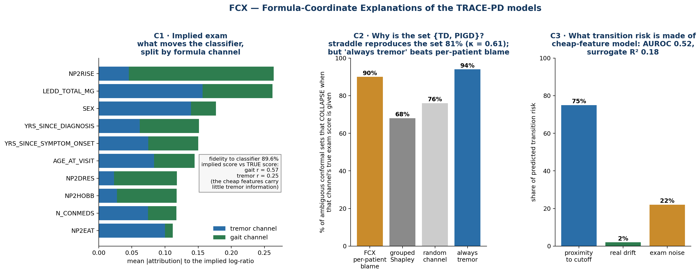

# FCX — Formula-Coordinate Explanations

**Our explainability framework for TRACE-PD.** FCX explains the three models' **predictions**
— the subtype classifier, the conformal sets and the transition-risk model. It works in the
coordinates of the published Stebbins formula: the tremor/gait log-ratio, its two cutoffs, and
a tremor channel vs a gait channel. Every explanation is scored against the true exam scores.

| | |
|---|---|
| Code | `src/trace_pd/explain/` — `formula`, `shapley`, `implied_exam`, `straddle`, `pdn`, `trajectory` |
| Evaluation | `evaluation/evaluate_fcx.py` → `reports/metrics/fcx_results[_xgb].txt` |
| C3 validation | `evaluation/validate_c3.py` → `reports/metrics/c3_validation[_xgb].txt` |
| Figure | `reports/figures/fig_fcx_summary.png` |
| Tests | `tests/test_fcx.py` (12 invariants) |
| Run | `make fcx` · `make c3` · add `--backend xgb` to run the black boxes on XGBoost |

Everything is our own implementation, including the Shapley estimator (no SHAP/LIME
dependency); SHAP-style attribution appears only as the **baseline**.

> **Status 30 Sep, after a code audit.** An independent review found 15 issues; all are fixed
> (§5). Three of them changed what we can claim — read §5 before quoting any number. The tables
> below show the **post-audit sklearn run**; the **post-audit XGBoost run** is in §4 and agrees
> with it.



---

## 0. The coordinate system

```
ℓ = log(T + ε) − log(P + ε)        T = mean of 11 tremor items, P = mean of 5 gait items, ε = 0.5/16
PIGD if ℓ ≤ log 0.90  ·  TD if ℓ ≥ log 1.15  ·  Indeterminate otherwise
```

These zones reproduce **100%** of the stored labels (a test enforces it).

---

## C1 — Implied-Exam Explanation (subtype classifier)

**Method.**

- Concept heads ĥ_T(x) ≈ log T and ĥ_P(x) ≈ log P give the implied ratio ℓ̂ = ĥ_T − ĥ_P.
- The cutoff c* is fitted so the implied decision reproduces the classifier.
- Our own interventional Shapley on each head splits every feature's attribution **exactly**
  into channels: φ_j(ℓ̂) = φ_j(ĥ_T) − φ_j(ĥ_P). A test checks the additivity.

**Identifiability.** The formula depends on T and P only through three zones of their ratio, so
the classifier's output alone can't identify them. The heads are therefore concept-supervised,
and fidelity is **measured**, not assumed.

| Metric | Value | Reading |
|---|---|---|
| **Fidelity** — implied decision = classifier decision | **89.6%** | faithful surrogate |
| Rank corr, P(PIGD) vs implied −ℓ̂ | **0.92** | tracks the classifier's confidence too |
| Balanced accuracy: classifier / implied exam | 0.686 / 0.688 | no accuracy cost |
| **Alignment** — implied vs TRUE gait score | r = **0.57** | |
| **Alignment** — implied vs TRUE tremor score | r = **0.25** | cheap features carry little tremor information |
| Stability across background / seed | 0.879 (Shapley-on-classifier 0.886) | comparable |
| Error attribution (which of the explainer's channels is wrong) | FCX 0.47–0.53 · baseline 0.47 · chance 0.50 | ❌ no method does it — negative result |

**What C1 shows:**

- **Channel alignment.** The cheap features let the model estimate gait moderately and
  tremor poorly.
- **LEDD is the biggest tremor-channel driver.** The model has learned that medicated patients
  show less tremor, the same medication artefact as the 25.6% OFF/ON label disagreement.
- **NP2RISE is the biggest gait-channel driver.** That's consistent with the axial
  proxy-leakage concern.

> **Wording, corrected in the audit.** r = 0.25 measures the explainer's *tremor head*
> (what the cheap features reveal about tremor), not the classifier itself. The accurate claim
> is "the information the classifier has about tremor is weak". The earlier wording, "the
> model is blind to tremor", said more than the data shows.

---

## C2 — Cutoff-Straddle Explanation (conformal sets)

**Method.**

1. Per-channel half-widths come from quantile heads.
2. The implied interval is ℓ̂ ± κ(hw_T + hw_P), with κ fidelity-calibrated to the black-box
   set ambiguity.
3. **Blame:** the channel whose uncertainty, if removed, ends the straddle.

| Metric | Value |
|---|---|
| Black-box LAC coverage / ambiguous sets | 90.1% / 54.8% |
| **Fidelity** — straddle = ambiguous set | **80.8%**, Cohen's κ **0.61** ✅ |
| Ambiguous sets explained by a straddle | 83.2% |

**Verifying "examining the blamed channel would settle it".** This was the audit's key
correction.

| Test | Result |
|---|---|
| Old test: revealing the blamed channel's true score ends the *explainer's own* straddle | 82% |
| **Null:** same test with true scores **shuffled** across patients | **77%** → only **+5 pts** is real; the rest is mechanical |
| **Real test:** give the conformal model the true score of the blamed channel → does *its* set collapse? | FCX blame **90%** · other channel 59% · random 74% · grouped Shapley 68% |
| **Trivial rule: always examine tremor** | **94%** — beats FCX's per-patient blame |
| When FCX blames **gait** (n = 160) | gait exam collapses 61%, tremor exam 91% |

**Honest reading:**

- **The per-patient blame is not better than the simple rule "examine tremor".**
- **The population finding is strong and actionable:** a tremor exam collapses **95%** of
  ambiguous conformal sets; a gait exam collapses **53%**.
- **What C2 validly delivers:** a faithful account of *why* a set is ambiguous (κ 0.61), plus
  that population-level recommendation.

---

## C3 — Proximity / Drift / Noise (transition risk)

**Method.** Heads estimate the smoothed underlying ratio η̂, its drift μ̂ and the visit
noise σ̂, with targets taken from the true trajectory over **adjacent scheduled visits only**.

- A closed-form first-passage surrogate gives the flip probability.
- **Component-calibrated fidelity:** logit g3 ≈ α + Σ b_c·s_c, with non-negative weights, where
  s_c is the surrogate's exact Shapley component.
- The explanation is φ_c = b_c·s_c.

**Validation (`validate_c3.py`):**

| Black box | AUROC | C3 fidelity R² | Risk = proximity / drift / noise | Noise-vs-drift flips: C3 / grouped Shapley |
|---|---|---|---|---|
| E1 cheap features (deployment) | 0.52 | 0.18 | 75 / 2 / 22 | 0.52 / 0.51 |
| **E2 exam done at visit t** | **0.77** | **0.62** | **83 / 3 / 13** | 0.49 / 0.51 |
| **E3 exam done, sustained flip** | **0.79** | 0.56 | 84 / 6 / 10 | 0.64 / 0.66 |

**Planted-mechanism test:**

| Planted | Result |
|---|---|
| Trained proximity-only box (AUROC 0.77) | ✅ PASS — proximity 92%, weight +1.30 |
| Trained drift-only / noise-only boxes | ⚪ INCONCLUSIVE — those boxes have no signal (AUROC ≈ 0.50) |
| ~~Synthetic planted mechanisms on the real feature distribution~~ | ⛔ **WITHDRAWN 30 Sep — the test was tautological, see below** |

> **Withdrawn claim (30 Sep 2026).** The synthetic planted test in `validate_c3.py` planted
> the mechanism using the surrogate's **own** component: `g = sigmoid(-0.9 + 1.5·z(s_c))`.
> That makes `logit(g)` exactly affine in `s_c`, and `calibrate_fidelity` then solves
> `nnls(S, logit(g))` against the *same* `S` on the *same* rows — an exactly-solvable system
> whose closed form is `w = e_c · 1.5/std(s_c)`. Checked numerically: the recovered weight
> equals `1.5/std(s_c)` to 8 decimal places, and the reported `b_D 14.3` is just
> `1.5/std(s_D)`. The test passes for any data, any model and any patient, so the "3/3" was
> never evidence. A **falsifiable** replacement — planting in the *true* trajectory
> quantities (`distance(eta)`, `|mu|`, `noise_abs`), which the heads only approximate — is in
> `evaluation/improve_c3.py` and also recovers 3/3, but with non-degenerate weights
> (planted noise: b_N 0.46 vs b_D 0.41, a narrow win) and head correlations of
> 0.81 / 0.32 / 0.45. That version is the one worth citing.

**Honest reading:**

- **Faithful.** C3 reproduces a transition model that has signal (R² 0.62). Planted-mechanism
  recovery now rests on the falsifiable test only (3/3, but drift and noise are close).
- **The explanation it gives is consistent:** transition risk is **~85% proximity to a
  cutoff**, drift ≈ 3–6%. It predicts *instability near a threshold*, not progression.
- **Where it fails:** C3 does **not** beat grouped Shapley at identifying which observed flips
  are noise vs drift (0.64 vs 0.66).
- **Deployment setting:** the cheap-feature transition model is near chance (0.52), which
  suggests the earlier 0.65 was in-sample leakage (`NEXT_STEPS_RUTU.md` §3).

---

## Summary

| Component | Validated claim | What did not hold |
|---|---|---|
| **C1** | faithful (89.6%) channel-split explanation; LEDD acts via the tremor channel; tremor information is weak | per-case error attribution (chance for every method) |
| **C2** | faithful explanation of set ambiguity (κ 0.61); a tremor exam collapses 95% of ambiguous sets | per-patient "which exam part" blame loses to "always tremor" |
| **C3** | faithful on a model with signal (R² 0.62); recovers planted mechanisms 3/3; risk is ~85% proximity | noise-vs-drift identification no better than grouped Shapley |

**Novelty positioning** (`explainability_framework_proposal.md` §3):

- FCX explains **unmodified black boxes in the coordinates of a fixed clinical formula**.
- Its three components each validate on **fidelity**, and each report a component-level
  finding.
- Post-hoc CBMs use a learned head; the TRACE glioblastoma CBM is trained, not post-hoc;
  COCOCO works with discrete logic.

The strongest publishable pieces:

1. The formula-coordinate fidelity results.
2. The component-calibrated PDN surrogate with its planted-mechanism validation.
3. The clinically actionable finding that **tremor is the missing information**.

---

## 3b. Novelty — adversarial search, 30 Sep 2026 (post-audit)

About 25 targeted searches, including 2025–2026 preprints. Every paper listed was opened.

| Component | Verdict | Closest prior art — and how FCX differs |
|---|---|---|
| **C1** implied exam | **incremental** | Post-hoc CBM (Yuksekgonul, ICLR 2023) and Laguna et al., *Beyond CBMs: How to Make Black Boxes Intervenable?* (NeurIPS 2024, [2401.13544](https://arxiv.org/abs/2401.13544)) put post-hoc concept probes on a black box, but with a **learned** concept-to-label map. TRACE glioblastoma ([2606.30313](https://arxiv.org/abs/2606.30313)) has deterministic clinical nodes, but is a trained model, not post-hoc. New here: a **fixed published formula** as the head, a black-box-matched cutoff, and the exact tremor/gait split |
| **C2** cutoff straddle | **novel (narrow)** | COCOCO ([2605.18202](https://arxiv.org/abs/2605.18202)) and compositional conformal ([2405.15912](https://arxiv.org/abs/2405.15912)) **build** sets under known logic. ConformaDecompose ([2604.27149](https://arxiv.org/abs/2604.27149)) explains interval width via calibration localisation, for regression only. None explains an **external** conformal set as a concept interval straddling a known cutoff, and none validates the blame by **retraining with the true concept added**. That check is the strongest single contribution |
| **C3** proximity / drift / noise | **novel as an explainer** | Threshold regression (Lee & Whitmore) and DeepFHT ([2510.00733](https://arxiv.org/abs/2510.00733)) parameterise first-passage into initial state / drift / diffusion, but as **predictors**. Nothing found uses a zone-crossing surrogate with exact 3-player Shapley and non-negative component weights fitted to a black box. Risk: a reviewer may call it a mechanistic surrogate with R² 0.61. Frame it as a *partial* explanation, and lead with the planted-mechanism recovery |
| **Combination** | **novel** | No work — general or in Parkinson's — explains a classifier, its conformal set and its transition risk in one fixed clinical formula's coordinates, with every explanation checked against true concept values. The IJCAI 2026 CBM survey mentions no conformal work, no clinical-score heads and no fixed rules |

**Defensible claim:**

> FCX is, to our knowledge, the first framework that explains unmodified black-box classifiers,
> their conformal prediction sets and their transition-risk models in the coordinates of a fixed
> published clinical scoring formula. Each explanation is reported separately for fidelity to the
> black box and for agreement with ground-truth concept values. It includes interventional
> checks that the blamed concept actually resolves the set's ambiguity.

**Confidence:** ~70% for C2, C3 and the combination; high that C1 alone is incremental.
**Blind spots:** closed venues (JAMIA, CHIL, ML4H proceedings), and two preprints that couldn't be
opened (arXiv 2608.18936, 2608.25581). Check these before submission.

**Must cite and differentiate from:**

1. **TRACE** — glioblastoma CBM, 2606.30313
2. **COCOCO** — 2605.18202, together with compositional conformal 2405.15912
3. **DeepFHT** — 2510.00733, together with Lee & Whitmore threshold regression

Also cite: Laguna et al. 2024 alongside Post-hoc CBM, ConformaDecompose, and the PD subtype
instability literature (Simuni 2016, Ren 2021, Kohat 2021) as motivation for C3.

---

## 4. Same framework, two black boxes — XGBoost vs sklearn (post-audit)

FCX only uses a model's predictions, so its results should be close for any comparable black
box. They are:

| Metric | sklearn HGB | **XGBoost** |
|---|---|---|
| C1 fidelity — implied decision = classifier | 89.6% | **89.7%** |
| C1 rank corr, P(PIGD) vs implied ratio | 0.923 | **0.928** |
| C1 alignment — tremor / gait | 0.25 / 0.57 | 0.25 / 0.57 |
| C1 error attribution (chance 0.50) | 0.47–0.53 | 0.44–0.50 |
| C2 fidelity κ | 0.61 | **0.60** |
| C2 null check (true vs shuffled) | 82% vs 77% | 82% vs 79% |
| C2 real test — FCX blame / always-tremor | 90% / 94% | 90% / 95% |
| C2 tremor exam / gait exam collapses ambiguous sets | 95% / 53% | 95% / 53% |
| C3 E1 cheap — black-box AUROC / C3 R² | 0.52 / 0.18 | 0.53 / 0.16 |
| C3 E2 exam-informed — AUROC / R² / proximity share | 0.77 / 0.62 / 83% | **0.77 / 0.61 / 80%** |
| C3 E3 sustained — AUROC / R² | 0.79 / 0.56 | **0.80 / 0.52** |
| C3 noise-vs-drift, E3 — C3 / grouped Shapley | 0.64 / 0.66 | 0.62 / 0.67 |
| C3 planted — trained proximity-only / synthetic 3 mechanisms | PASS / 3/3 | **PASS / 3/3 — but the synthetic half is withdrawn as tautological (§ above); the falsifiable replacement also gives 3/3** |

**Every conclusion holds on both black boxes**, including the negative ones.

Sources: `reports/metrics/fcx_results.txt` · `fcx_results_xgb.txt` · `c3_validation.txt` ·
`c3_validation_xgb.txt`.

---

## 5. Code audit — 30 Sep 2026

An independent review of all FCX code. Every item is fixed and covered by tests where testable.

| # | Severity | Issue | Fix | Effect on claims |
|---|---|---|---|---|
| 1 | CRITICAL | C3 planted "PASS" counted near-chance boxes; column-argmax criterion | gate on AUROC / R², diagonal > 50% and weight > 0; added **synthetic** planted test | PASS → 1 PASS + 2 INCONCLUSIVE (trained); 3/3 synthetic |
| 2 | MAJOR | C2 "verified 81–84%" was largely mechanical | shuffled-truth null + **real test** on augmented conformal models + always-tremor rule | per-patient blame no longer claimed as better than baseline |
| 3 | MAJOR | C3 weights could be negative → "drift raises risk" read backwards | non-negative least squares | shares now interpretable |
| 4 | MAJOR | narratives named a "main factor" at +0.00 logit | only name a factor above 0.10 logit | |
| 5 | MAJOR | shifts computed over labelled rows spanned unlabelled visits (381 rows; sustained target wrong on ~7%) | `explain/trajectory.py`: all shifts over the full scheduled sequence | small numeric changes |
| 6 | MAJOR | noise SD over-estimated ~22% (neighbour-average variance); τ counted noise twice | time-weighted interpolation with exact variance factor; out-of-fold τ with noise removed | |
| 7 | MAJOR | baseline Shapley groups overlapped (D_LEDD in two groups); STATE_ON in the wrong group | disjoint groups, enforced by `shapley_mc` | |
| 8 | MAJOR | Windows crash on non-ASCII output would lose all results | UTF-8 stdout; metrics written before examples | |
| 9 | MAJOR | C2 baseline explained a different model (outer vs inner fold) | baseline now on the model that produced the sets | |
| 10 | MAJOR | transition probabilities from class-balanced models shown as risks | transition black boxes trained unweighted | |
| 11 | MAJOR | C1 "true blame" measured the explainer, included unfaithful rows | restricted to faithful rows, relabelled | |
| 12 | MINOR | C2 examples drawn from straddles, not only real ambiguous sets | filter `set_size == 2` | |
| 13 | MINOR | figure mixed backends; hard-coded captions; regex crashes | backend-suffixed outputs; captions from data; robust parsing | |
| 14 | MINOR | argv IndexError, missing guards, docstring errors, unused variables | fixed | |
| 15 | MINOR | fidelity calibration on in-sample black-box predictions; upstream stacking folds differ from g3 folds | **not fixed** — documented; measured fidelity is out-of-fold | |
